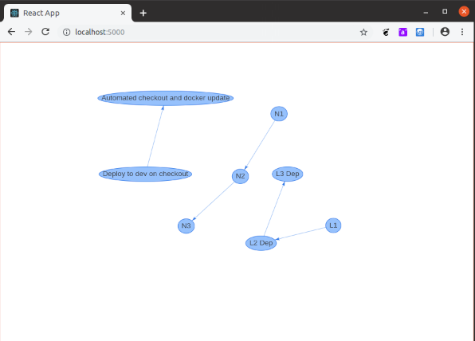

# github-deps

NB this repo generates a static view, and doesn't support private repos.

Generate graphs from github uses marked up with convention-using tags.




1. Set up config.js:

```
module.exports = {
	owner: 'Vid',
	repo: 'github-deps',
	dependsOn: 'DependsOn'
};
```

2. run `npm run gen`. This generates data files which are imported from the client-side pages in src.
3. run `npm run build` to build those pages.
4. Access those pages, for example, `npm install -g serve` then `serve -s build`.
